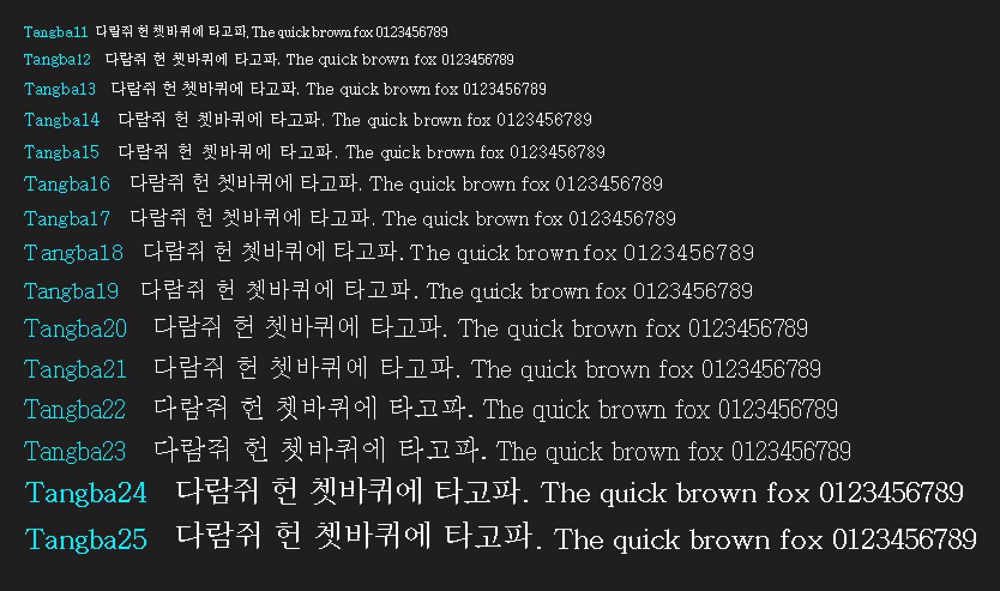

# Tangba 탕바

바탕의 비트맵 글꼴에서 모양을 가져온 픽셀 폰트.

## 폰트 미리보기

[사용해 보기](https://monadabxy.com/fonts/tangba/)



## 다운로드

[최신 버전 다운로드](https://github.com/MonadABXY/tangba-font/releases/latest)

## 웹폰트 적용

HTML `<link>` 태그 또는 CSS `@import` 방식으로 폰트를 불러온 후 사용할 수 있습니다.

### `<link>`

```html
<link rel="stylesheet" href="https://cdn.jsdelivr.net/gh/MonadABXY/tangba-font/tangba.css" />
```

### `@import`

```css
@import url("https://cdn.jsdelivr.net/gh/MonadABXY/tangba-font/tangba.css");
```

### `폰트 패밀리로 사용`

```css
font-family: "Tangba12", sans-serif;
```

### `클래스로 사용`

```css
<div class="tangba12">탕바 12px</div>
```

## 권장 크기

폰트가 흐릿해지는 현상을 방지하고 또렷하게 출력하기 위해 **지정된 기본 픽셀 크기 또는 그 정수 배수**로 사용하는 것을 권장합니다.
고해상도 또는 인쇄물에서는 신경쓰지 않아도 됩니다.

| 폰트 종류    | px     | pt        |
| :----------- | :----- | :-------- |
| **Tangba11** | `11px` | `8.25pt`  |
| **Tangba12** | `12px` | `9pt`     |
| **Tangba13** | `13px` | `9.75pt`  |
| **Tangba14** | `14px` | `10.5pt`  |
| **Tangba15** | `15px` | `11.25pt` |
| **Tangba16** | `16px` | `12pt`    |
| **Tangba17** | `17px` | `12.75pt` |
| **Tangba18** | `18px` | `13.5pt`  |
| **Tangba19** | `19px` | `14.25pt` |
| **Tangba20** | `20px` | `15pt`    |
| **Tangba21** | `21px` | `15.75pt` |
| **Tangba22** | `22px` | `16.5pt`  |
| **Tangba23** | `23px` | `17.25pt` |
| **Tangba24** | `24px` | `18pt`    |
| **Tangba25** | `25px` | `18.75pt` |

## 라이선스 및 크레딧

### 라이선스

**Tangba**는 [SIL 오픈 폰트 라이선스 1.1](https://openfontlicense.org/) 하에 배포됩니다.

개인 및 기업 사용자를 포함한 누구나 자유롭게 사용, 수정 및 재배포할 수 있습니다.

단, 폰트 파일 자체를 단독으로 유료 판매하는 것은 금지됩니다.

- [OFL 1.1](./OFL.txt)
